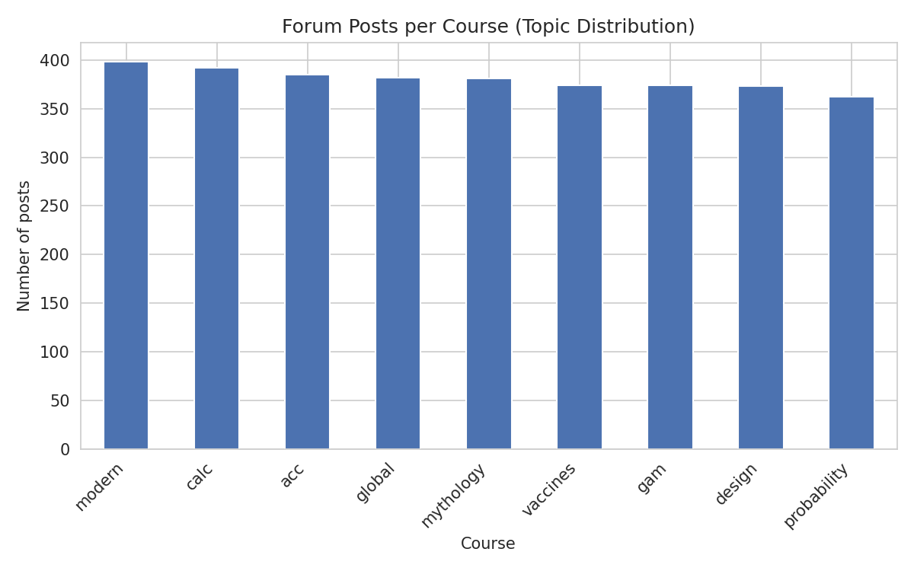
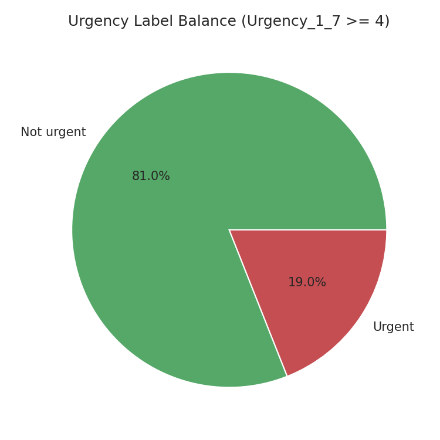
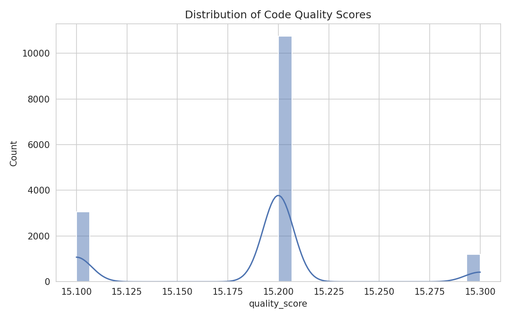
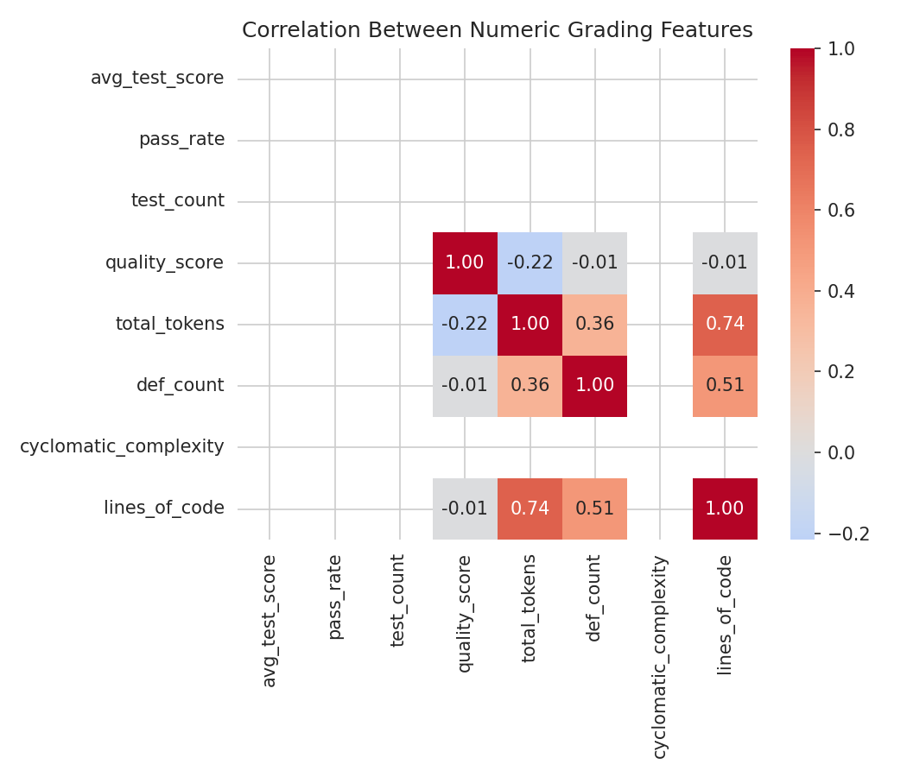
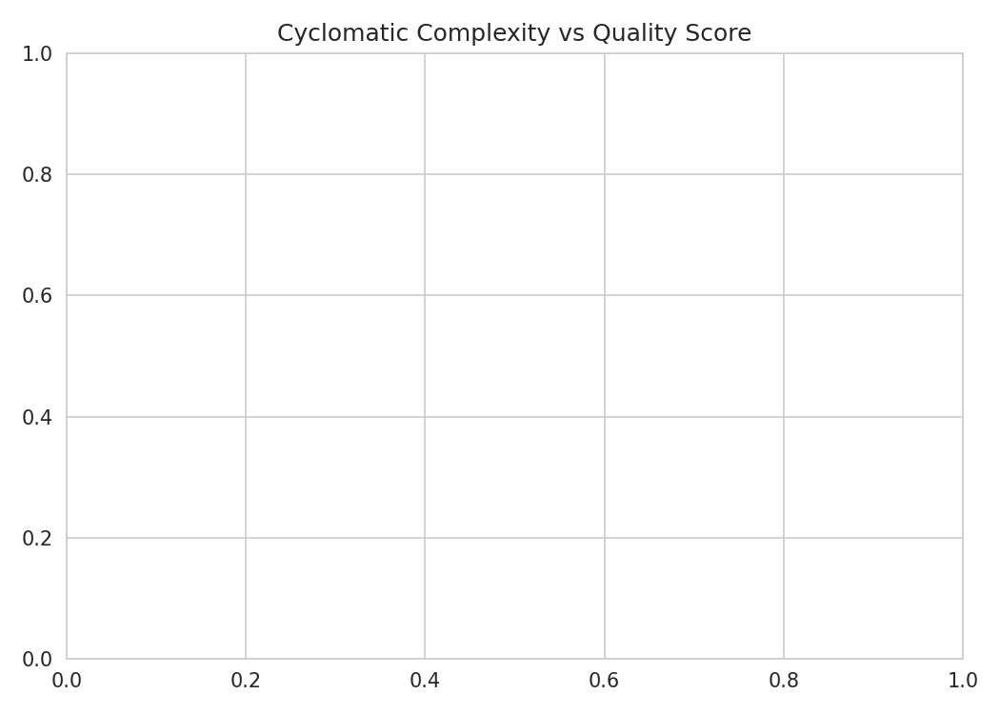
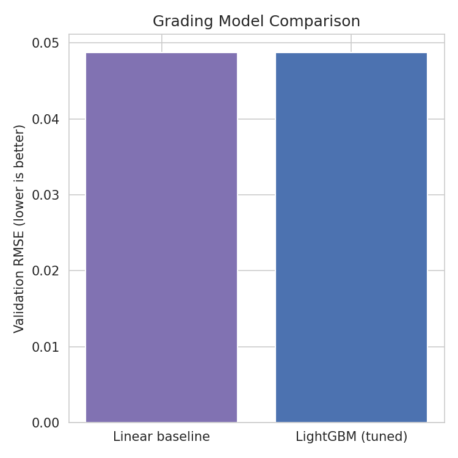
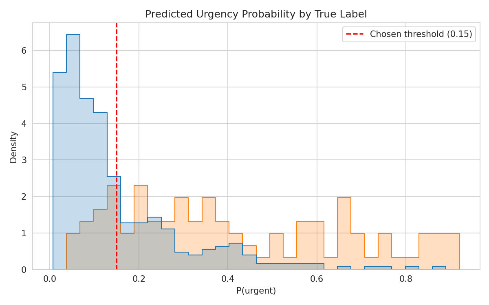
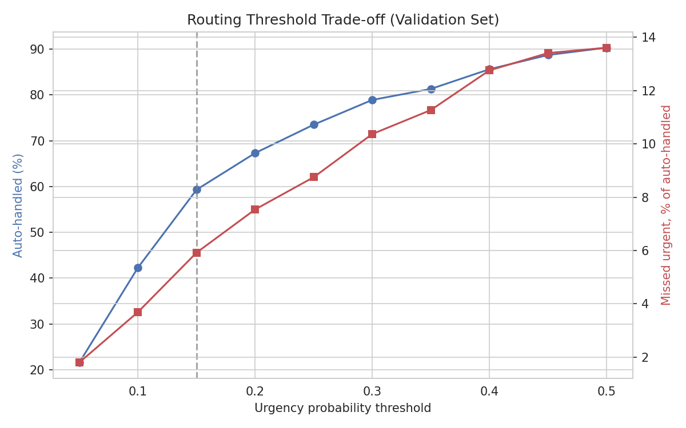

# Confidence-Gated LMS Triage & Grading

An ML pipeline for a Learning Management System (LMS) that does two jobs:

1. **Grades code submissions** — predicts a quality score for a student's code.
2. **Triages student doubts** — figures out which course a forum post belongs to,
   and whether it's urgent enough to skip the queue and go straight to a teacher.

The second task is the interesting one: instead of just classifying urgent vs.
not, the system only **auto-handles** a doubt when it is *confident the doubt
is NOT urgent*. Anything it's unsure about — or confident is urgent — gets
escalated to a human. That asymmetry is deliberate: missing a genuinely urgent
doubt is far more costly than a teacher reviewing one extra doubt that turns
out to be fine.

---

## Prerequisites

To re-run the notebook (`LMS_ML_Pipeline_v3_RealData.ipynb`) yourself:

- Python 3.9+ (Colab's default runtime works out of the box)
- Internet access (both datasets are pulled live — GitHub raw CSVs and a
  Hugging Face parquet file)
- Packages: `pandas`, `numpy`, `scikit-learn`, `matplotlib`, `seaborn`,
  `lightgbm`, `radon` — installed by the notebook's setup cell
  (`!pip install -q lightgbm radon datasets`)

No GPU is required — every model here (LightGBM, HistGradientBoostingRegressor,
logistic regression) trains in well under a minute on CPU.

---

## The datasets

### 1. Grading data — `sjelassi/new_omi_code_100k` (Hugging Face)

100k LLM-generated coding solutions. A 15,000-row sample is used. Each row
has:

| Field | What it is |
|---|---|
| `answer` | the actual generated code |
| `pass_rate` | fraction of automated tests the code passed |
| `test_count` | number of tests run against it |
| `quality_score` | the target — a composite quality label |
| `total_tokens`, `def_count`, `has_docstring` | structural proxies shipped with the dataset |

**Important caveat:** `pass_rate` and `quality_score` are both produced by an
automated grading harness, not a human — they're a noisy proxy for real code
quality, not ground truth. The pipeline is built around that limitation
rather than pretending it isn't there.

### 2. Triage data — `pcla-code/forum-posts-urgency` (GitHub, MIT license)

Real student discussion-forum posts from 9 Stanford MOOCs (accounting,
calculus, design, game theory, globalization, modern poetry, mythology,
probability, vaccines), hand-coded by researchers for urgency on a 1–7 scale
(Almatrafi et al.). Each of the 9 courses ships as two partition files
(e.g. `acc1`, `acc2`) — these are two chunks of the *same* course, not two
different courses.

- **Topic label:** the course the post came from (9 classes)
- **Urgency label:** `Urgency_1_7 >= 4` → urgent (the threshold used in the
  published literature on this dataset). Urgent posts are a minority class
  (~19%), matching the imbalance reported in that literature.

---

## What was done to the data

**Triage data:**
- `id` is a *per-course* sequential ID from the original corpus, not a global
  primary key — the same `id` shows up in multiple courses by coincidence. A
  composite key (`course` + `id`) was built before deduplicating, otherwise
  valid rows get dropped as false duplicates.
- A small number of genuine duplicate rows (same course + id) were removed.
- Rows missing `post_text` or `Urgency_1_7` were dropped.

**Grading data:**
- Checked every numeric column's correlation with `quality_score` to rule out
  leakage (nothing came back suspiciously high — `pass_rate` and `test_count`
  are legitimately predictive, not leaky, since they exist *before* quality
  is scored).
- Cyclomatic complexity and lines-of-code were computed directly from the
  `answer` column using `radon`. A handful of samples don't parse (truncated
  generations, syntax errors) — those become `NaN` and are **median-imputed**
  rather than dropped, since a failed-to-parse submission is itself
  informative (it likely also failed most tests).

---

## Models

| Task | Model | Why |
|---|---|---|
| Grading (development) | Linear Regression (baseline) vs. LightGBM vs. HistGradientBoostingRegressor, tuned via `RandomizedSearchCV`, 5-fold CV | All three trained and compared during development |
| Grading (deployed) | **HistGradientBoostingRegressor** | Selected for production — see deployment note below |
| Topic classification | Logistic Regression on TF-IDF (unigrams + bigrams, 5000 features), `class_weight="balanced"` | Simple, fast, strong baseline for 9-class text classification |
| Urgency classification | Logistic Regression wrapped in `CalibratedClassifierCV` (sigmoid, 5-fold) | Calibration matters here because the routing decision below depends on the *probability* being trustworthy, not just the class label |

All splits are 70/15/15 (train/val/test), stratified where relevant, with the
test set touched exactly once at the end.

### Why HistGradientBoostingRegressor instead of LightGBM in deployment

LightGBM was trained and tuned alongside HistGradientBoostingRegressor during
development, and both were compared on the validation set. LightGBM's Python
package ships as a wheel that dynamically links against `libgomp.so.1` (the
GNU OpenMP runtime) at import time — it doesn't bundle that library, it just
expects it to already exist on the host system. Vercel's Python serverless
runtime doesn't include `libgomp.so.1`, and unlike a normal Linux server there's
no `apt-get`/system-package install step in Vercel's build pipeline to add it.
The result is an import-time crash in production, even though the exact same
code runs fine locally or in Colab.

`HistGradientBoostingRegressor` (from `sklearn.ensemble`) is pure-Python/Cython
and ships as part of scikit-learn itself, with no external compiled
dependency to resolve at runtime — so it deploys cleanly on Vercel with no
workaround needed. Its validation performance was close enough to LightGBM's
that swapping the deployed model cost negligible accuracy for a large gain in
deployment reliability. LightGBM numbers are kept in this README as a
development-time comparison point, not as the model actually serving
predictions in `/api/grade`.

**Would LightGBM work if deployed locally instead of on Vercel?** Generally
yes. On a normal Linux machine (bare metal, VM, or Docker image built from a
standard base like `python:3.11-slim`), `libgomp.so.1` is almost always
already present — it ships as part of `libgomp1`/`libstdc++`, which most base
images and distros include or pull in as a dependency of something else. On
Windows, LightGBM's wheel bundles the OpenMP runtime it needs differently and
doesn't hit this specific issue. The problem here is specific to Vercel's
minimal, locked-down serverless Python environment, not to LightGBM or to
"production" in general — a self-hosted server, a VM, or even a Docker
container with `apt-get install -y libgomp1` in the Dockerfile would run
LightGBM without any of this.

### Routing rule

Auto-handle a doubt only when `P(urgent) < 0.15`. This threshold was chosen
by sweeping it on the validation set: below 0.15, too few doubts get
auto-handled to be useful; above it, the share of auto-handled doubts that
were actually urgent climbs past 6–7% and keeps rising. At 0.15, roughly 60%
of doubts can be auto-handled while only ~6% of those are missed urgent
cases.

---

## Visualizations

The notebook includes a plotting cell (`generate_plots.py` in this repo —
paste it in as a new cell after the grading and triage cells have run) that
saves the following to a `plots/` folder:

| Plot | Shows |
|---|---|
| `01_topic_distribution.png` | How many forum posts came from each course |
| `02_urgency_balance.png` | Urgent vs. non-urgent post split |
| `03_quality_score_distribution.png` | Spread of code quality scores |
| `04_feature_correlation_heatmap.png` | Correlation between grading features (the leakage check, visualized) |
| `05_complexity_vs_quality.png` | Does more complex code score higher or lower? |
| `06_grading_model_comparison.png` | Baseline vs. LightGBM vs. HistGradientBoostingRegressor validation RMSE |
| `07_urgency_probability_distribution.png` | Predicted urgency probability, split by true label, with the 0.15 threshold marked |
| `08_threshold_tradeoff.png` | Coverage vs. missed-urgent rate across thresholds — the actual justification for picking 0.15 |

Once generated, drop the images here:










---

## Using the live API

The trained models are served as two endpoints. 
`[https://YOUR-PROJECT.vercel.app](https://lms-ml-pipeline.vercel.app/)` 

### `POST /api/triage`

Classify a student doubt by topic and urgency.

**Request**
```json
{
  "post_text": "I cannot submit my assignment and the deadline is in 20 minutes, please help urgently"
}
```

**Response**
```json
{
  "predicted_topic": "calc",
  "urgency_probability": 0.82,
  "auto_handle": false,
  "threshold_used": 0.15
}
```

`auto_handle: false` means this doubt gets routed to a teacher instead of
being closed automatically.

### `POST /api/grade`

Score a code submission using the deployed **HistGradientBoostingRegressor**
model. `pass_rate` and `test_count` are optional — if you don't have
test-harness results yet, leave them out and the saved imputer fills in a
sensible default.

**Request**
```json
{
  "code": "def add(a, b):\n    \"\"\"Add two numbers.\"\"\"\n    return a + b",
  "pass_rate": 0.9,
  "test_count": 5
}
```

**Response**
```json
{
  "predicted_quality_score": 15.2029,
  "model_used": "HistGradientBoostingRegressor",
  "cyclomatic_complexity": 1,
  "lines_of_code": 2
}
```

### `GET /api/health`

Returns `{"status": "ok"}` — useful for confirming the deployment is live
before sending real requests.

---

## Summary

| Task | Model | Metric | Result |
|---|---|---|---|
| Grading (deployed) | HistGradientBoostingRegressor | Test RMSE / R² | 0.049 / 0.105 (Test MAE: 0.031) |
| Grading (dev comparison only, not deployed) | LightGBM | Val RMSE | 	0.049 (Val R²: 0.120) |
| Triage — topic | Logistic Regression (TF-IDF) | Val macro-F1 | 	0.667 |
| Triage — urgency | Calibrated Logistic Regression | Val macro-F1 @ 0.5 | 0.703 (balanced accuracy: 0.669) |
| Routing | Confidence threshold = 0.15 | Test coverage / missed-urgent rate | 59.3% auto-handled, 5.92% of those missed-urgent |

The point of using real (rather than synthetic) data here wasn't a better
leaderboard number — real numbers are messier than a hand-built generative
process produces. The value is that every modeling decision above (the
composite key, the calibration, the asymmetric threshold, and the deployment
model swap) was a response to something the data or the platform actually
did, not something anticipated in advance.
